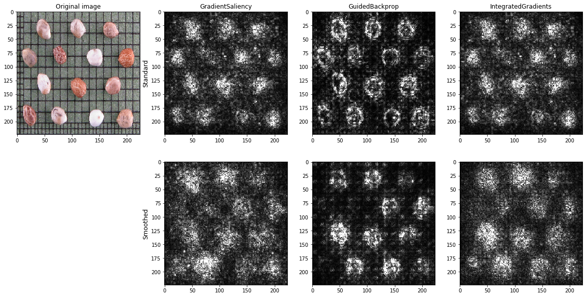

DEEP Open Catalogue: Medical Image Classification
=========================================

[](https://jenkins.indigo-datacloud.eu/job/Pipeline-as-code/job/DEEP-OC-org/job/image-classification-tf/job/master/)

---
> This is an updated version of the image classification module with support image classification with DICOM data.

Changes with respect to master:
* now *.txt files must point to .npy uint 16 files (instead of images) of shape (H, W, C).
* It is possible to use this branch with an arbitrary number of channels C. If C is different from 3 finetuning
 from ImageNet weigths is no longer available.
* data augmentation is no longer supported
* url disabled
* api doesn't check for image format

---

**Author:** [Lara Lloret](https://github.com/laramaktub) (CSIC)

**Project:** This work is part of the [DEEP Hybrid-DataCloud](https://deep-hybrid-datacloud.eu/) project that has
received funding from the European Union’s Horizon 2020 research and innovation programme under grant agreement No 777435.

This is a plug-and-play tool to train and evaluate an image classifier on a custom dataset using deep neural networks.

You can find more information about it in the [DEEP Marketplace](https://marketplace.deep-hybrid-datacloud.eu/modules/deep-oc-image-classification-tf-dicom.html).

**Table of contents**
1. [Installing this module](#installing-this-module)
    1. [Local installation](#local-installation)
    2. [Docker installation](#docker-installation)
2. [Train other satellites](#train-an-image-classifier)
    1. [Data preprocessing](#1-data-preprocessing)
        1. [Prepare the images](#11-prepare-the-images)
        2. [Prepare the data splits](#12-prepare-the-data-splits)
    2. [Train the classifier](#train-an-image-classifier)
3. [Test an image classifier](#test-an-image-classifier)
4. [More info](#more-info)
5. [Acknowledgements](#acknowledgments)

## Installing this module

### Local installation

> **Requirements**
>
> This project has been tested in Ubuntu 18.04 with Python 3.6.5. Further package requirements are described in the
> `requirements.txt` file.
> - It is a requirement to have [Tensorflow>=1.14.0 installed](https://www.tensorflow.org/install/pip) (either in gpu 
> or cpu mode). This is not listed in the `requirements.txt` as it [breaks GPU support](https://github.com/tensorflow/tensorflow/issues/7166). 
> - Run `python -c 'import cv2'` to check that you installed correctly the `opencv-python` package (sometimes
> [dependencies are missed](https://stackoverflow.com/questions/47113029/importerror-libsm-so-6-cannot-open-shared-object-file-no-such-file-or-directo) in `pip` installations).

To start using this framework clone the repo and download the [default weights](https://api.cloud.ifca.es:8080/swift/v1/imagenet-tf/default_imagenet.tar.xz):

```bash
git clone https://github.com/deephdc/image-classification-tf-dicom
cd image-classification-tf-dicom
pip install -e .
curl -o ./models/default.tar.gz https://cephrgw01.ifca.es:8080/swift/v1/imagenet-tf/default_imagenet.tar.xz
cd models && tar -zxvf default_imagenet.tar.gz && rm default_imagenet.tar.gz
```
now run DEEPaaS:
```
deepaas-run --listen-ip 0.0.0.0
```
and open http://0.0.0.0:5000/ui and look for the methods belonging to the `imgclas` module.

### Docker installation

We have also prepared a ready-to-use [Docker container](https://github.com/deephdc/DEEP-OC-image-classification-tf-dicom) to
run this module. To run it:

```bash
docker search deephdc
docker run -ti -p 5000:5000 -p 6006:6006 -p 8888:8888 deephdc/deep-oc-image-classification-tf-dicom
```

Now open http://0.0.0.0:5000/ui and look for the methods belonging to the `imgclas` module.


## Train an image classifier

You can train your own audio classifier with your custom dataset. For that you have to:

### 1. Data preprocessing

The first step to train you image classifier if to have the data correctly set up. 

#### 1.1 Prepare the images

Put your images in the`./data/images` folder. If you have your data somewhere else you can use that location by setting
 the `image_dir` parameter in the training args. 
Please use a standard image format (like `.png` or `.jpg`). 

#### 1.2 Prepare the data splits

First you need add to the `./data/dataset_files` directory the following files:

| *Mandatory files* | *Optional files*  | 
|:-----------------------:|:---------------------:|
|  `classes.txt`, `train.txt` |  `val.txt`, `test.txt`, `info.txt`|

The `train.txt`, `val.txt` and `test.txt` files associate an image name (or relative path) to a label number (that has
to *start at zero*).
The `classes.txt` file translates those label numbers to label names.
Finally the `info.txt` allows you to provide information (like number of images in the database) about each class. 

You can find examples of these files at  `./data/demo-dataset_files`.

### 2. Train the classifier

> **Tip**: Training is usually depend on the training args you use. Although the default ones work reasonable well,
> you can explore how to modify them with the [dataset exploration notebook](./notebooks/1.0-Dataset_exploration.ipynb).

Go to http://0.0.0.0:5000/ui and look for the ``TRAIN`` POST method. Click on 'Try it out', change whatever training args
you want and click 'Execute'. The training will be launched and you will be able to follow its status by executing the 
``TRAIN`` GET method which will also give a history of all trainings previously executed.

If the module has some sort of training monitoring configured (like Tensorboard) you will be able to follow it at 
http://0.0.0.0:6006.


## Test an image classifier

Go to http://0.0.0.0:5000/ui and look for the `PREDICT` POST method. Click on 'Try it out', change whatever test args
you want and click 'Execute'. You can **either** supply a:

* a `data` argument with a path pointing to an image.

OR
* a `url` argument with an URL pointing to an image.
  Here is an [example](https://file-examples.com/wp-content/uploads/2017/10/file_example_PNG_500kB.png) of such an url
  that you can use for testing purposes.


## More info

You can have more info on how to interact directly with the module (not through the DEEPaaS API) by examining the 
``./notebooks`` folder:

* [dataset exploration notebook](./notebooks/1.0-Dataset_exploration.ipynb):
  Visualize relevant statistics that will help you to modify the training args.

* [computing predictions notebook](./notebooks/3.0-Computing_predictions.ipynb):
  Test the classifier on a number of tasks: predict a single local image (or url), predict multiple images (or urls),
  merge the predictions of a multi-image single observation, etc.


* [predictions statistics notebook](./notebooks/3.1-Prediction_statistics.ipynb):
  Make and store the predictions of the `test.txt` file (if you provided one). Once you have done that you can visualize
  the statistics of the predictions like popular metrics (accuracy, recall, precision, f1-score), the confusion matrix, etc.

* [saliency maps notebook](./notebooks/3.2-Saliency_maps.ipynb):
  Visualize the saliency maps of the predicted images, which show what were the most relevant pixels in order to make the prediction.



Finally you can [launch a simple webpage](./imgclas/webpage/README.md) to use the trained classifier to predict images (both local and urls) on your favorite browser.


## Acknowledgements

If you consider this project to be useful, please consider citing the DEEP Hybrid DataCloud project:

> García, Álvaro López, et al. [A Cloud-Based Framework for Machine Learning Workloads and Applications.](https://ieeexplore.ieee.org/abstract/document/8950411/authors) IEEE Access 8 (2020): 18681-18692. 
